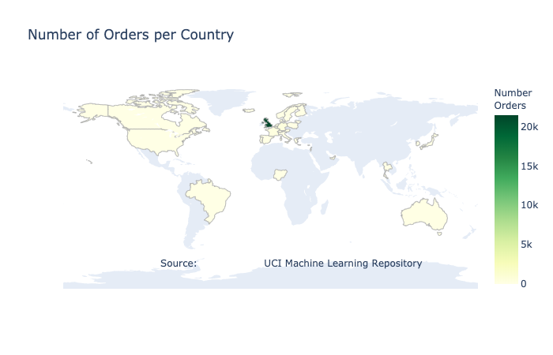
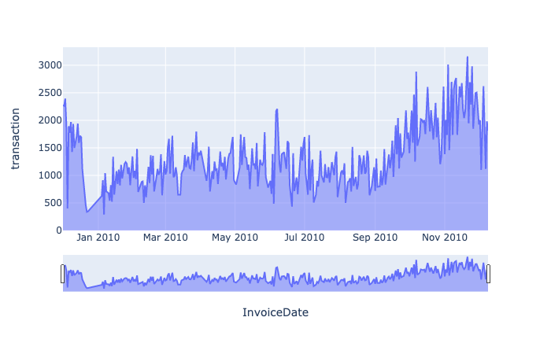
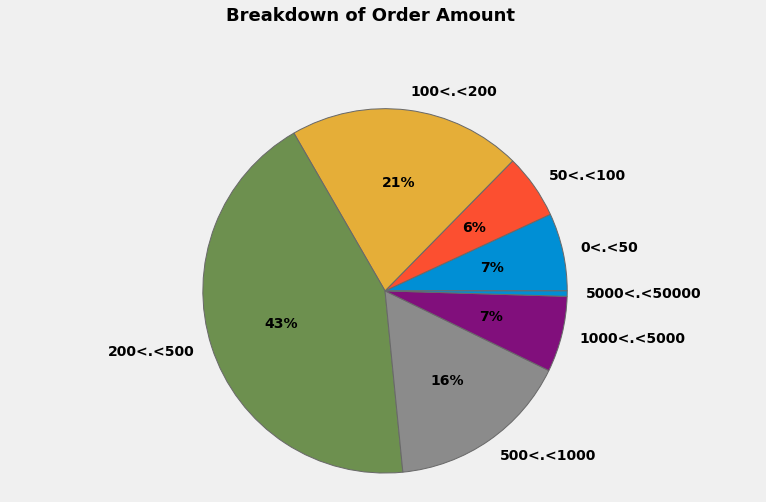

# Data Science Customer Segmentation: Project Overview
- Created the overall transaction from E-commerce platform between 01/12/2009 until 01/12/2010 using plotly
- Created the map based on the country that doing a transaction in E-commerce platform
- Clustered the products into 5 categories and clustered the customers into 11 categories using KMeans and enhanced it by Silhouette Score
- Created several classification models, test the quality of the models using learning curves and optimized Logistic Regression, Gradient Boosting and KNN Clasifier using Voting Classifier

# Data Cleaning
The data is collected from UCI Machine Learning entitled "Online Retail II Data Set". I made the following changes and create new variables:
- Deleted the 20.5% missing values on CustomerID variables and drop the 50% duplicate values in dataframe
- Deleted the 2.37% data without counterparts that the transaction previously made 
- There are 16 products that contains "Testing Product", so I delete this product
- Added the quantity cancellation and total price that previously grouped by customerID
- Counted the amount of customer who have done several transactions

# Exploratory Data Analyses (EDA)
I create several visualizations that retrieve information about the habit of transaction and the habit of customers

 

# Model Building
Firstly, I use Priciple Component Analyses (PCA) to distinguish the object clearly. I also separate the train data which is the first 10 months in dataframe and the test data which is the last 2 months in dataframe.

I use `Scikit Learn` library and several models and evaluate it using learning curves. I tried Logistic Regression, K-Neighbors Classifier, Support Vector Machine Classifier, Random Forest, Decision Tree, and Gradient Boosting Classifier.

The result from all models that I used and evaluate it using learning curves, I used:
- Logistic Regression, K-Neighbors Classifier, and Gradient Boosting Classfier.
- All this three models are combined into one prediction using VotingClassifier and get training score (92.74%) and testing score (90.23%)

# Testing the Prediction
Finally, I use the train data which is the two last months and test it using the VotingClassifier and I found 97.92% of customers are awarded the right classes.

# Code and Resources Used
**Python Version:** 3.7.6
**Packages:** Pandas, Numpy, Matplotlib, Plotly, Scikit-learn, WordCloud
**Dataset:** [UCI Machine Learning](https://archive.ics.uci.edu/ml/datasets/Online+Retail+II)
**Learning Curve Articles:** [Machine Learning Mastery](https://machinelearningmastery.com/learning-curves-for-diagnosing-machine-learning-model-performance/)
**Customer Segmentation Article:** [FabienDaniel - Customer Segmentation](https://machinelearningmastery.com/learning-curves-for-diagnosing-machine-learning-model-performance/)
